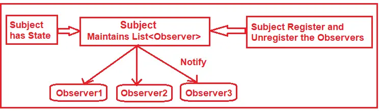
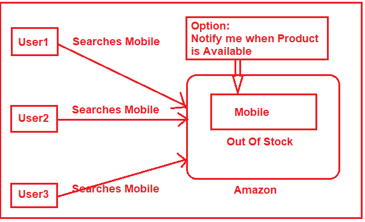
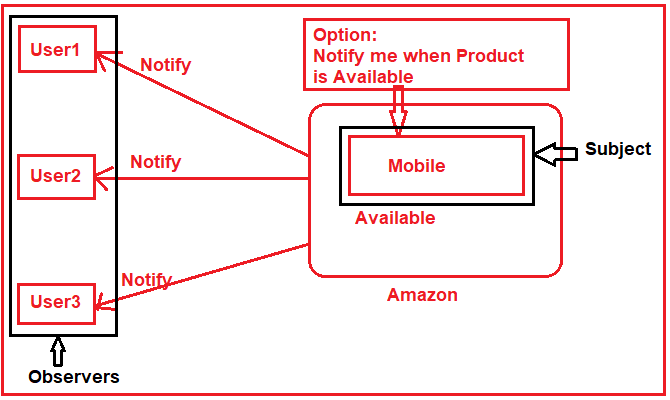

<h1>Observer Design Pattern?</h1>

<h3>
    According to GoF, the Observer Design Pattern Defines 
    a one-to-many dependency between objects so that when one 
    object changes state, 
    all its dependents are notified and updated automatically.
</h3>

<h2>How Does the Observer Design Pattern Work?</h2>

<h3>The observer design pattern has two main components. They are as follows</h3>
<ul>
    <li>
        <b>Subject:</b> They are also called Publishers. When a change occurs to a subject, it should notify all its Subscribers/Observers.
    </li>
    <li>
        <b>Observers:</b> They are also called subscribers. They listen to the changes in the subjects.
    </li>
</ul>



<p>
    As shown in the above image, we can define the Subject as an object that 
    maintains a list of observers. The Subject has methods to Register and 
    Unregister the Observers. As you can see, there are three observers 
    registered within the subject. If any new observer wants to register, 
    he/she needs to call the Register method of the Subject. 
    Again, if any observer wants to unregister, 
    he/she needs to call the Unregister method of the subject.
</p>

<p>
    The subject has some state. Whenever some changes occur in the state, 
    the subject will notify all the registered observers by calling one 
    of the observer methods. Once the observer gets the notification from 
    the subject, the observer 
    will call one of the methods of the subject to get the change state data. 
</p>

<h2>
    Real-Time Example to Understand Observer Design Pattern:
</h2>
<p>
    Let us understand the Observer Design Pattern with one Real-Time Example. 
    Please have a look at the following diagram. 
    Here, we are taking the example of the Amazon ECommerce Application.
</p>




<h3>
    Step1: Creating the Subject Interface
</h3>

```c#
namespace ObserverDesignPattern
{
    // The Subject Interface
    public interface ISubject
    {
        // Register an observer to the subject.
        void RegisterObserver(IObserver observer);

        // Remove or unregister an observer from the subject.
        void RemoveObserver(IObserver observer);

        // Notify all registered observers when the state of the subject is changed.
        void NotifyObservers();
    }
}

```

<h3>
    Step2: Creating Concrete Subject
</h3>

```c#
using System;
using System.Collections.Generic;
namespace ObserverDesignPattern
{
    // The ConcreteSubject class
    // The Subject have states and notifies all observers when the state changes.
    public class Subject : ISubject
    {
        // The List of Observer is going to store in the following collection object
        private List<IObserver> observers = new List<IObserver>();

        //The following properties are going to store the Product Information
        private string ProductName { get; set; }
        private int ProductPrice { get; set; }
        private string Availability { get; set; }

        // Initializing the Product information using the constructor
        public Subject(string productName, int productPrice, string availability)
        {
            ProductName = productName;
            ProductPrice = productPrice;
            Availability = availability;
        }

        //The following Method is going to return the State of the Product
        public string GetAvailability()
        {
            return Availability;
        }

        //The following Method is going to set the State of the Product
        public void SetAvailability(string availability)
        {
            this.Availability = availability;
            Console.WriteLine("Availability changed from Out of Stock to Available.");
            NotifyObservers();
        }

        // The observer will register with the Product using the following method
        public void RegisterObserver(IObserver observer)
        {
            Console.WriteLine("Observer Added : " + ((Observer)observer).UserName);
            observers.Add(observer);
        }
        
        // The observer will unregister from the Product using the following method
        public void RemoveObserver(IObserver observer)
        {
            Console.WriteLine("Observer Removed : " + ((Observer)observer).UserName);
            observers.Remove(observer);
        }

        // The following Method will be sent notifications to all observers
        public void NotifyObservers()
        {
            Console.WriteLine("Product Name :"
                            + ProductName + ", product Price : "
                            + ProductPrice + " is Now available. So, notifying all Registered users ");

            Console.WriteLine();
            foreach (IObserver observer in observers)
            {
                //By Calling the Update method, we are sending notifications to observers
                observer.Update(Availability);
            }
        }
    }
}
```

<h3>Step3: Creating Observer Interface:</h3>

```c#
namespace ObserverDesignPattern
{
    // The Observer Interface
    public interface IObserver
    {
        // Receive Notification from Subject
        void Update(string availability);
    }
}
```

<h3>Step4: Creating Concrete Observer</h3>

```c#
using System;
namespace ObserverDesignPattern
{
    // The ConcreteObserver class
    // Concrete Observer react to the updates issued by the Subject 
    public class Observer : IObserver
    {
        //The following Property is going to hold the observer's name
        public string UserName { get; set; }

        //Creating the Observer
        public Observer(string userName)
        {
            UserName = userName;
        }

        //Registering the Observer with the Subject
        public void AddSubscriber(ISubject subject)
        {
            subject.RegisterObserver(this);
        }

        //Removing the Observer from the Subject
        public void RemoveSubscriber(ISubject subject)
        {
            subject.RemoveObserver(this);
        }

        //Observer will get a notification from the Subject using the following Method
        public void Update(string availabiliy)
        {
            Console.WriteLine("Hello " + UserName + ", Product is now " + availabiliy + " on Amazon");
        }
    }
}
```


<h3>
    Step5: Client
</h3>


```c#
using System;
namespace ObserverDesignPattern
{
    class Program
    {
        static void Main(string[] args)
        {
            //Create a Product with Out of Stock Status
            Subject RedMI = new Subject("Red MI Mobile", 10000, "Out Of Stock");

            //User Anurag will be created and the user1 object will be registered to the subject
            Observer user1 = new Observer("Anurag");
            user1.AddSubscriber(RedMI);

            //User Pranaya will be created and the user1 object will be registered to the subject
            Observer user2 = new Observer("Pranaya");
            user2.AddSubscriber(RedMI);

            //User Priyanka will be created and the user3 object will be registered to the subject
            Observer user3 = new Observer("Priyanka");
            user3.AddSubscriber(RedMI);

            Console.WriteLine("Red MI Mobile current state : " + RedMI.GetAvailability());
            Console.WriteLine();

            user3.RemoveSubscriber(RedMI);

            // Now the product is available
            RedMI.SetAvailability("Available");

            Console.Read();
        }
    }
}
```


<pre> 
Observer Added : Anurag
Observer Added : Pranaya
Observer Added : Priyanka
Red MI Mobile current state : Out Of Stock

Observer Removed : Priyanka
Availability changed from Out of Stock to Available.
Product Name :Red MI Mobile, product Price : 10000 is Now available. So, notifying all Registered users

Hello Anurag, Product is now Available on Amazon
Hello Pranaya, Product is now Available on Amazon

</pre>