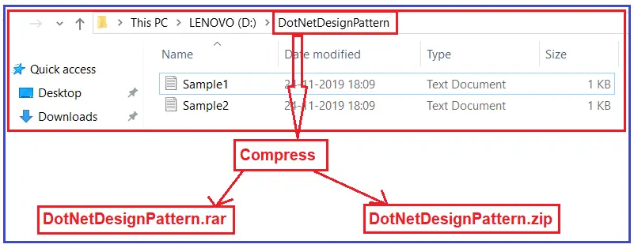

<h1>Strategy Design Pattern</h1>

<h3>According to the Gang of Four Definitions, define a family of algorithms, encapsulate each one, and make them interchangeable. Strategy lets the algorithm vary independently from clients that use it.</h3>


<p>
The Strategy Design Pattern is a Behavioral Design Pattern that enables selecting an algorithm’s behavior at runtime. Instead of implementing a single algorithm directly, run-time instructions specify which of a family of algorithms to use. This pattern is ideal when you need to switch between different algorithms or actions in an object dynamically. That means the Strategy Design Pattern is used when we have multiple algorithms (solutions) for a specific task, and the client decides which algorithm to use at runtime. 
</p>

<h2>Understanding the Strategy Design Pattern with Real-time Example:</h2>

<p>Let us understand the Strategy Design Pattern in C# using one real-time example. 
    Please have a look at the following image. As you can see, in my D drive, I have a folder called DotNetDesignPattern; within that folder, multiple text files are there. My business requirement is
     to compress this DotNetDesignPattern folder and send the compressed file to the client.
</p>

<p>
    For this requirement, I have two solutions. The first solution is to compress the folder into RAR format and send it to the client; the second is to compress the folder into ZIP format and send it to the client. 
    So, for the above requirement, I have two solutions shown in the image below.
</p>



<p>
    As per the Strategy Design Pattern, multiple solutions exist for a Particular Problem (Task). The client will decide which solution to use only at runtime, not compilation time. So, in our example, 
    the client will decide at runtime in which format he wants the file.
</p>

<h2>How to Implement the Strategy Design Pattern in C#?</h2>
<p>
    The Strategy Pattern defines a set of algorithms, encapsulates each algorithm, and makes them interchangeable. It lets the algorithm vary independently from clients that use it. Let’s 
break down the implementation of the Strategy Pattern in C#:
</p>
<ul>
    <li>
        Strategy (Interface or Abstract Class): This defines an interface common to all supported algorithms. Context uses this interface to call the algorithm defined by a ConcreteStrategy.
    </li>
    <li>
        ConcreteStrategy: This implements the algorithm using the Strategy interface.
    </li>
    <li>
        Context: This maintains a reference to a Strategy object and may define an interface that lets Strategy access its data.
    </li>

</ul>

<h3> Step 1: Creating Strategy Interface </h3>


```c#

namespace StrategyDesignPattern
{
    public interface ICompression
    {
        void CompressFolder(string compressedArchiveFileName);
    }
}

```

    <h3>
        Step 2: Creating Concrete Strategies
    </h3>

    <h4>RarCompression:</h4>


```c#

using System;
namespace StrategyDesignPattern
{
    // Concrete Strategy A
    // The following RarCompression Concrete Strategy implement the Strategy Interface and 
    // Implement the CompressFolder Method. 
    public class RarCompression : ICompression
    {
        public void CompressFolder(string compressedArchiveFileName)
        {
            Console.WriteLine("Folder is compressed using Rar approach: '" + compressedArchiveFileName
                + ".rar' file is created");
        }
    }
}
```

<h4>
    Zip Compression:
</h4>

``` c#
using System;
namespace StrategyDesignPattern
{
    // Concrete Strategy B
    // The following ZipCompression Concrete Strategy implement the Strategy Interface and 
    // Implement the CompressFolder Method. 
    public class ZipCompression : ICompression
    {
        public void CompressFolder(string compressedArchiveFileName)
        {
            Console.WriteLine("Folder is compressed using zip approach: '" + compressedArchiveFileName
                + ".zip' file is created");
        }
    }
}
```

<h3>Step 3: Creating Context</h3>


```c#
namespace StrategyDesignPattern
{
    // The Context Provides the interface which is going to be used by the Client.
    public class CompressionContext
    {
        // The Context has a reference to one of the Strategy objects. 
        // The Context does not know the concrete class of a strategy. 
        // It should work with all strategies via the Strategy interface.
        
        private ICompression Compression;

        //Initializing the Strategy Object i.e. Compression using Constructor
        public CompressionContext(ICompression Compression)
        {
            // The Context accepts a strategy through the constructor, 
            // but also provides a setter method to change the strategy at runtime
            this.Compression = Compression;
        }

        //The Context allows replacing a Strategy object at runtime.
        public void SetStrategy(ICompression Compression)
        {
            this.Compression = Compression;
        }

        // The Context delegates the work to the Strategy object instead of
        // implementing multiple versions of the algorithm on its own.
        public void CreateArchive(string compressedArchiveFileName)
        {
            //The CompressFolder method is going to be invoked based on the strategy object
            Compression.CompressFolder(compressedArchiveFileName);
        }
    }
}
```

<h3>Step 4: Client</h3>


``` c#

using System;
namespace StrategyDesignPattern
{
    class Program
    {
        static void Main(string[] args)
        {
            // The client code picks a concrete strategy and passes it to the context. 
            // The client should be aware of the differences between strategies in order to make the right choice.

            //Create an instance of ZipCompression Strategy
            ICompression strategy = new ZipCompression();

            //Pass ZipCompression Strategy as an argument to the CompressionContext constructor
            CompressionContext ctx = new CompressionContext(strategy);
            ctx.CreateArchive("DotNetDesignPattern");

            //Changing the Strategy using SetStrategy Method
            ctx.SetStrategy(new RarCompression());
            ctx.CreateArchive("DotNetDesignPattern");

            Console.Read();
        }
    }
}
```

<pre>
    Folder is compressed using zip approach: 'DotNetDesignPattern.zip' file is created
    Folder is compressed using Rar approach: 'DotNetDesignPattern.rar' file is created
</pre>

<h2>
    Use Cases of Strategy Design Pattern:
</h2>

<ul>
    <li>
        When you have many classes that differ only in their behavior, 
        strategies provide a way to configure a class with one of many behaviors.
    </li>
    <li>
        When you need to switch algorithms used within an object at runtime dynamically.
    </li>
    <li>
        When you have a lot of conditional statements in different places to execute various behaviors of the same algorithm.
    </li>
</ul>

<h2>Read more</h2>

<ul>
    <li>
        <a href="https://dotnettutorials.net/lesson/strategy-design-pattern/" target="_blank" rel="noopener noreferrer">Dot Net Tutorials</a>
    </li>
</ul>

